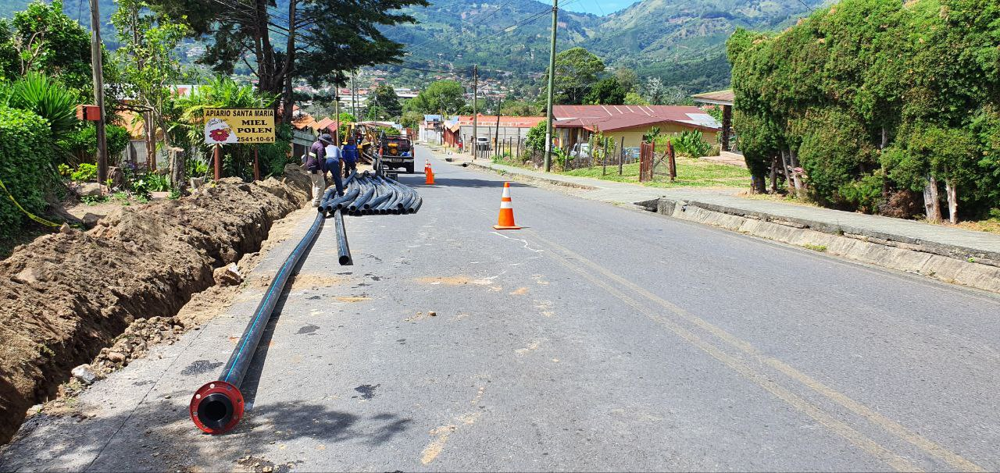
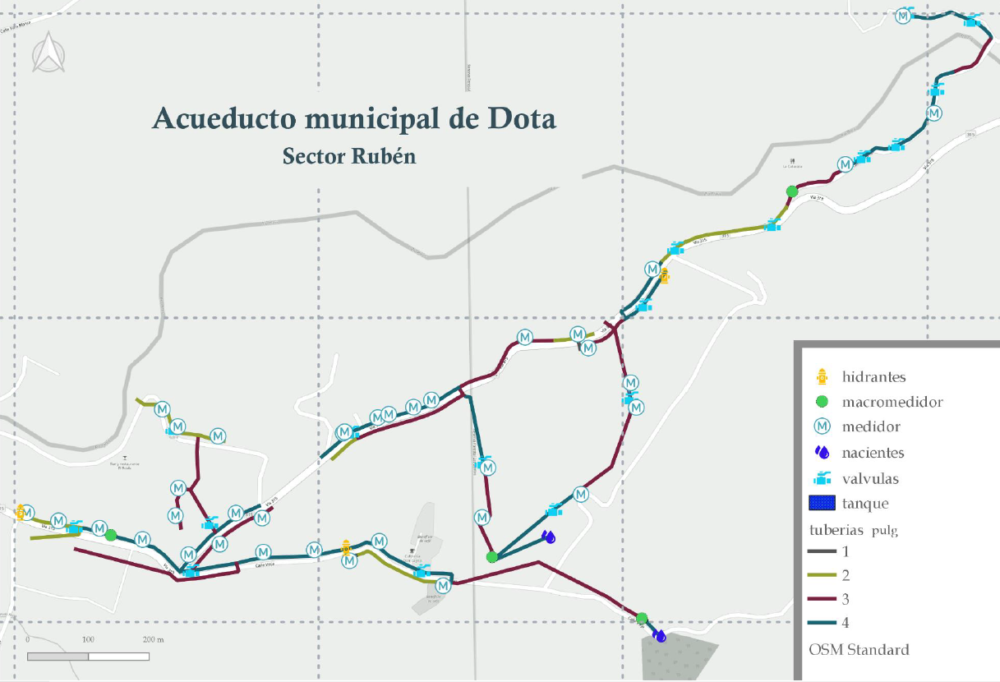

# PLANIFICACIÓN DE UNA BASE DE DATOS: ACUEDUCTO DEL MUNICIPIO DE DOTA

## Descripción del sitio

El municipio de Dota es el gobierno local que administra el [Cantón de Dota](https://es.wikipedia.org/wiki/Cant%C3%B3n_de_Dota) y del cual se compone de tres distritos: *Santa María, Copey y El Jardín*. Dentro de los servicios que brinda el municipio a las comunidades se resalta la recolección de residuos sólidos, recolección de material valorizable, gestión vial (mejora y mantenimiento de caminos), planificación urbana, catastro y avalúos, entre otros.
En cuanto al **desarrollo económico** del lugar, se centra en el sector cafetalero, siendo una zona reconocida por exportar [café de calidad](https://www.larepublica.net/noticia/cafes-de-santa-maria-de-dota-seleccionados-como-los-mejores-de-costa-rica-en-taza-de-la-excelencia). También hay un importante desarrollo turístico comunitario, donde se desarrolla actividades de senderismo, birding, pesca de trucha, tours de café, etc.
Administra uno de los cantones **menos densamente poblados** del país y cerca del **85%** del territorio se encuentra en reserva forestal o zonas protegidas ([Los Santos](https://en.wikipedia.org/wiki/Los_Santos_Forest_Reserve), [Parque Nacional Los Quetzales](https://en.wikipedia.org/wiki/Los_Quetzales_National_Park) y [Reserva Biológica Cerro Vueltas](https://en.wikipedia.org/wiki/Vueltas_Hill_Biological_Reserve)). Estas características han sido un reto para el municipio, ya que las comunidades se encuentran muy dispersas entre sí, dificultando proveer el servicio para toda la población y aunado a esto, debe de disponer de más esfuerzos para solventar los conflictos de tenencias de tierra y uso de suelo dentro de la reserva.

**Figura 1**. Centro del parque de Santa María de Dota: Ernesto Zumbado.
*Imagen propia*

Bajo el contexto anterior, es importante enfatizar que actualmente no provee del servicio de *agua potable, mantenimiento de vías y recolección de residuos* a varias de las comunidades que se encuentran dentro del territorio que administra. Centra las labores en los centros de distrito, donde se ubica la mayoría de la población, el resto de las comunidades han logrado solventar estos servicios bajo los esfuerzos de las **asociaciones** creadas.
El Departamento de Acueducto actualmente dispone de **tres funcionarios** en oficina para desarrollar actividades administrativas y de un grupo de cuatro asistentes de campo. Además, dispone de una bodega donde guardan materiales del acueducto en caso de requerir reparaciones o mantenimiento.

## Problemática y estado del acueducto municipal

Con respecto al **Departamento de Acueducto**, no se dispone de ningún método para la gestión de datos del acueducto, cuentan con el levantamiento topográfico de algunos sectores del acueducto, pero no en su totalidad y sin atributos que permitan tomar decisiones basado en los resultados. La captación del recurso se realiza por nacientes de agua, conformando el sistema por la tubería de conducción hasta los tanques de almacenamiento y brindar el servicio a los hogares mediante la tubería de distribución. El acueducto contempla macromedidores en nueve sectores, válvulas, hidrantes y los micromedidores en las tomas domiciliares.
Disponen de un sistema de búsqueda por número de medidor para realizar los cobros, el cual se encarga una funcionaria del departamento para realizarlo.
El acueducto municipal brinda el servicio en el centro de *Santa María, El Jardín y de Copey*.

**Figura 2**. Cambio en tubería PEAD de acueducto.
*Imagen propia*

La problemática evidente de la falta de gestión de activos se relaciona al desconocimiento de la **ubicación de los elementos y la cantidad que hay**. Si no existe una correcta gestión y conocimiento del sistema, se vuelve complicado controlar situaciones como las mejoras a realizar, las ampliaciones del sistema, la regulación por las tuberías (control con válvulas) y las posibles decisiones de cambios que optimicen el servicio.

## Descripción de datos

Para la conformación de la base de datos se dispone de los siguientes componentes con las variables respectivas:

* Válvula: {**codigo_valvula**, tipo, presión, cumplimiento, estado, fecha_mantenimiento, fecha_instalación, id_tuberia}
* Naciente: {**id_naciente**, nombre}
* Hidrante: {**codigo_hidrante**, pobl_servicio, estado, fecha_mantenimiento, fecha_instalación, id_tuberia}
* Tubería: {**id_tuberia**, diámetro_pulgadas, diámetro_milímetros, material, distancia, estado, fecha_mantenimiento, fecha_instalacion, id_tanque}
* Tanque: {**id_tanque**, capacidad, nombre, material, estado, fecha_mantenimiento, fecha_instalación, id_naciente}
* Medidor: {**numero_medidor**, numero_finca, estado, fecha_mantenimiento, fecha_instalación, id_tuberia, cedula}
* Macromedidor: {**codigo_macro**, caudal, estado, fecha_mantenimiento, fecha_instalación, id_tuberia}
* Cliente: {**cedula**, nombre}

### Propósito de la base de datos

Lo que se pretende desarrollar en este estudio es solventar la necesidad de disponer de un **sistema de gestión de activos para el acueducto municipal**. Además de la georreferenciación de los elementos, se integra información para análisis y toma de decisiones como diámetros, fecha de mantenimiento y de instalación.

**Figura 3**. Gestión de activos: Acueductor sector Rubén.
*Imagen propia*

 Contemplando la base de datos se solventaría el poco control que tienen los funcionarios, así como el desconocimiento de los sitios en donde se localiza parte del acueducto. También funcionaría para determinar el presupuesto anual del departamento y organizar el stock de materiales que tienen en la bodega, evitando comprar material de mantenimiento o cambio en caso de roturas que no se utilizaría con prontitud.

### Referencia

 La información expuesta en esta sección fue suministrada durante la entrevista aplicada a *Dagoberto Tencio*, realizada el *17 de julio, 2023*.
